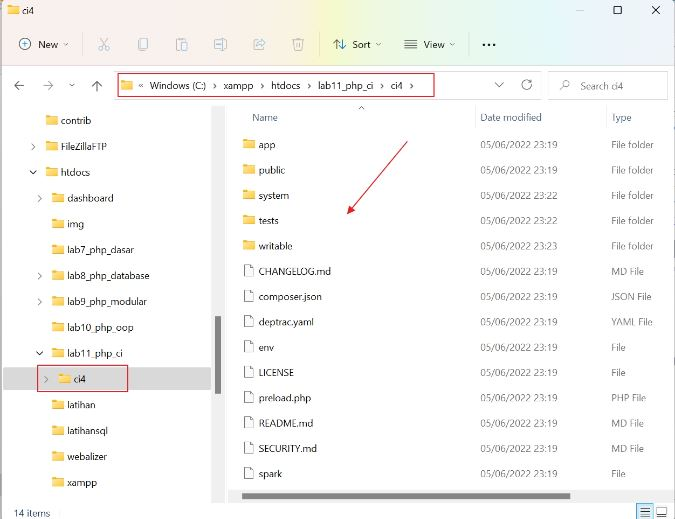

# Pemograman Web2 Pertemuan 16

## Profil
| #               | Biodata                      |
| --------------- | ---------------------------- |
| **Nama**        | M. AKMAL AL ABDILAH          |
| **NIM**         | 312110034                    |
| **Kelas**       | TI.21.A.1                    |
| **Mata Kuliah** | Pemrograman Web 2            |
| **Jabatan**     | Ketua Kelompok 8             |

<p align="center">
 
</p>
<p align="center">
<a href="https://github.com/akmalabdilah"></a>
<p align="center">


<hr>

## Uas Pemograman Web 2 : Sistem Pengelolaan Kas Rt

<hr>

<hr>

## Anggota Kelompok 8
| Nim              | Nama                          | Jabatan        |
| ---------------- | ----------------------------- | -------------- |
| **312110034**    | M. AKMAL AL ABDILAH           | Ketua          |
| **312210098**    | ROBIYANTO                     | Wakil          |
| **312110027**    | ILHAM MAULANA CHAKRA DWI NOTO | Perancangan    |
| **312110604**    | FLANDILAN RUI                 | Sistem analis  |
| **3121100178**   | MUHAMAD AZIZUL DZIKRI         | Progamer       |

<hr>

 
 **`Tampilan sistem di web`**
 


Gambar 1. Tampilan Sistem


<p>
Disini saya sebagai ketua kelompok 8 akan menjelaskan cara pembuatan sistem seperti gambar di atas di bagian menu about sisanya seperti menu yang lain dan database akan di jelaskan di link yang berbeda dan anggota kelompok dan wakil saya.
</p>

<h1>
Pertama Kalian harus mendowload fremwork CodeIgniter
</h1>


<p>
Linknya kalian bisa melihat digambar yang ada di atas atau bisa mengklik link di bawah atau kalian biasa mendownload file lengkap di atas atau juga bisa meliat tutor lengkap buat pemula di ling github saya di bawah.
</p>


```
https://www.codeigniter.com/download
```

```
https://github.com/akmalabdilah/lampu-keriting.git
```

<h1>
Kedua setelah kalian mendowload fremwork CodeIgniter kalian langsung ektrak dan tempatkan file seperti gambar di bawah ini.
</h1>



 
<h1>
Ketiga kalian buka menu cmd cli dan ketik.
</h1>

```
php spark serve
```

Seperti gambar di bawah. 
 
 

<h1>
Keempat kalian buka file yang telah di ektrak di visual studio code seperti gambar di bawah.
</h1>
 

  
<h1>
Kelima kalian buat file di views/tamplte yang berisi file header_view.php dan footer_view.php kode ada di bawah.
</h1>  

<p>
kode header_view.php
</p>

```php
<!DOCTYPE html>
<html lang="en">
<head>
<title><?= $title;?></title>
    <!-- Required meta tags -->
    <meta charset="utf-8">
    <meta name="viewport" content="width=device-width, initial-scale=1, shrink-to-fit=no">
    <link rel="stylesheet" href="<?= base_url('/style.css');?>">
<!-- Bootstrap CSS -->
<link rel="stylesheet" href="https://stackpath.bootstrapcdn.com/bootstrap/4.3.1/css/bootstrap.min.css" integrity="sha384-ggOyR0iXCbMQv3Xipma34MD+dH/1fQ784/j6cY/iJTQUOhcWr7x9JvoRxT2MZw1T" crossorigin="anonymous">
  </head>
  <body>
    <div id="container">
    <header>
    <center><h1>Aplikasi Pengelolaan Kas Rt</h1></center>
    </header>
<nav class="nav nav-pills">
   
    </a>
    <a href="<?= base_url('/');?>" class="active">Home</a>
    <a href="<?= base_url('/about');?>">About</a>
    <a href="<?= base_url('/warga');?>">Warga</a>
    <a href="<?= base_url('/iuran');?>">Iuran Kas</a>
    <a href="<?= base_url('/laporan');?>">Laporan</a>
    <a href="<?= base_url('/Dashboard_home');?>">Dashboard</a>
</nav>

<section id="wrapper">
    <section id="main">
```

<p>
footer_view.php
</p>

```php
<!DOCTYPE html>
<html lang="en">
<head>
    <meta charset="UTF-8">
    <meta http-equiv="X-UA-Compatible" content="IE=edge">
    <meta name="viewport" content="width=device-width, initial-scale=1.0">
    <title>Aplikasi Pengolahan Kas Rt</title>

    <link rel="stylesheet" href="https://cdn.jsdelivr.net/npm/bootstrap@4.3.1/dist/css/bootstrap.min.css" integrity="sha384-ggOyR0iXCbMQv3Xipma34MD+dH/1fQ784/j6cY/iJTQUOhcWr7x9JvoRxT2MZw1T" crossorigin="anonymous">
    <link rel="stylesheet" href="https://cdnjs.cloudflare.com/ajax/libs/font-awesome/6.1.1/css/all.min.css" integrity="sha512-KfkfwYDsLkIlwQp6LFnl8zNdLGxu9YAA1QvwINks4PhcElQSvqcyVLLD9aMhXd13uQjoXtEKNosOWaZqXgel0g==" crossorigin="anonymous" referrerpolicy="no-referrer" />

    <script src="https://code.jquery.com/jquery-3.3.1.slim.min.js" integrity="sha384-q8i/X+965DzO0rT7abK41JStQIAqVgRVzpbzo5smXKp4YfRvH+8abtTE1Pi6jizo" crossorigin="anonymous"></script>
    <script src="https://cdn.jsdelivr.net/npm/popper.js@1.14.7/dist/umd/popper.min.js" integrity="sha384-UO2eT0CpHqdSJQ6hJty5KVphtPhzWj9WO1clHTMGa3JDZwrnQq4sF86dIHNDz0W1" crossorigin="anonymous"></script>
    <script src="https://cdn.jsdelivr.net/npm/bootstrap@4.3.1/dist/js/bootstrap.min.js" integrity="sha384-JjSmVgyd0p3pXB1rRibZUAYoIIy6OrQ6VrjIEaFf/nJGzIxFDsf4x0xIM+B07jRM" crossorigin="anonymous"></script>
    <script src="https://cdnjs.cloudflare.com/ajax/libs/font-awesome/6.1.1/js/all.min.js" integrity="sha512-6PM0qYu5KExuNcKt5bURAoT6KCThUmHRewN3zUFNaoI6Di7XJPTMoT6K0nsagZKk2OB4L7E3q1uQKHNHd4stIQ==" crossorigin="anonymous" referrerpolicy="no-referrer"></script>
<!-- Optional JavaScript -->
    <!-- jQuery first, then Popper.js, then Bootstrap JS -->
    <script src="https://code.jquery.com/jquery-3.3.1.slim.min.js" integrity="sha384-q8i/X+965DzO0rT7abK41JStQIAqVgRVzpbzo5smXKp4YfRvH+8abtTE1Pi6jizo" crossorigin="anonymous"></script>
    <script src="https://cdnjs.cloudflare.com/ajax/libs/popper.js/1.14.7/umd/popper.min.js" integrity="sha384-UO2eT0CpHqdSJQ6hJty5KVphtPhzWj9WO1clHTMGa3JDZwrnQq4sF86dIHNDz0W1" crossorigin="anonymous"></script>
    <script src="https://stackpath.bootstrapcdn.com/bootstrap/4.3.1/js/bootstrap.min.js" integrity="sha384-JjSmVgyd0p3pXB1rRibZUAYoIIy6OrQ6VrjIEaFf/nJGzIxFDsf4x0xIM+B07jRM" crossorigin="anonymous"></script>
</head>
<body>
    </section>
     
    </section>
    <footer>
    <div class="row">
        <div class="card col-sm-12 text-white bg-dark">
            <div class="card-body text-center">
           
                <p>&copy; 2023 - Universitas Pelita Bangsa</p>
        </footer>
        </div>
    </body>
    </html>
```

<h1>
Keenam kalian buat file di views yang berisi file about.php kode ada di bawah.
</h1>  


<p>
about.php
</p>


```php
<!DOCTYPE html>
<html lang="en">
<head>
     <meta charset="UTF-8">
     <title><?= $title; ?></title>
</head>
<body>
<?= $this->include('template/header_view'); ?>
<div class="container pt-5">
<h1><?= $title; ?></h1>
<hr>
<div class="container pt-5">
<p><?= $content; ?></p>
<br>
<div class="row">
<div class="container">
     <br>
                
                <br>
                <div class="container pt-4">
                <center><h1>KELOMPOK 8</h1></center>
                <center><p>Mahasiswa Teknik Informatika <strong>Universitas Pelita Bangsa</strong> 
                Kelas : T1.21.A.1.
                Tugas Pemograman Web 2.
                </p></center>
            </div>
            <br>
<?= $this->include('template/footer_view'); ?>
</body>
</html>
```


  <hr>
  
  Cukup Sekian Penjelasan Dari saya sisa penjelasan akan di jelaskan oleh rekan kelompok saya di link video youtube.
  
  **SELESAI**
  <hr>

<div>
<h2 align="center">Thanks For Reading!!!</h2>
<div align="center">


